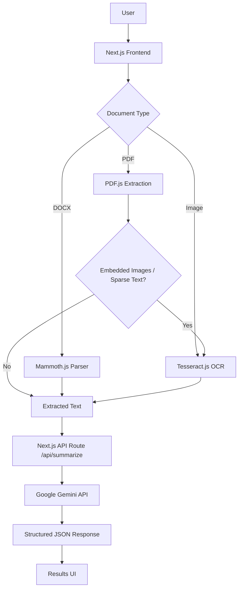

# 📄 Document Summary Assistant

> AI-powered document analysis and summarization for PDF, DOCX, and image files.

### 🚀 Live Demo
**[https://unthinkable-proj-sahil-23-bce-5114-document-summary-5z7x1ybrr.vercel.app/](https://unthinkable-proj-sahil-23-bce-5114-document-summary-5z7x1ybrr.vercel.app/)**

---

## 1. Project Overview
The Document Summary Assistant is a lightweight web application that allows users to upload documents and instantly receive intelligent summaries, key points, topics, and actionable suggestions. It supports multiple file formats including PDF, DOCX, PNG, and JPG/JPEG. The application processes files client-side to minimize network payload, utilizing a robust extraction pipeline before generating structured insights via the Google Gemini API.

## 2. Problem Statement
Modern documents often contain large amounts of information scattered across standard text, scanned pages, tables, and images. Manually reviewing and extracting this data is time-consuming. This project solves this by providing a unified document-processing pipeline that extracts raw text, conditionally applies OCR for image-based content, and relies on a Large Language Model (LLM) to generate structured, easily consumable insights.

## 3. Key Features
- **📁 Multi-format Document Upload**: Natively handles PDF, DOCX, PNG, and JPG/JPEG.
- **🖱️ Drag & Drop**: Seamless upload support via drag-and-drop or standard file picker.
- **📑 PDF Text Extraction**: Extracts native, selectable text from PDF documents.
- **🔍 Intelligent OCR**: Applies optical character recognition (OCR) to images, scanned PDF pages, and embedded PDF images.
- **📄 DOCX Processing**: Parses Microsoft Word documents, preserving paragraphs, headings, and tables.
- **🤖 AI Summarization**: Integrates with the Google Gemini API for deep contextual understanding.
- **📏 Configurable Summary Length**: Users can toggle between short, medium, or long summary outputs.
- **🎯 Key Points & Topics**: Automatically identifies primary topics and extracts the most vital information.
- **💡 Improvement Suggestions**: Provides document-level feedback and suggestions where applicable.
- **⏳ Rich Processing States**: Real-time UI feedback mapping the extraction, OCR, and AI generation phases.
- **⚠️ Error Handling**: Gracefully handles invalid formats, overly large files, extraction failures, and API constraints.
- **📱 Responsive UI**: Fully responsive interface built with Tailwind CSS.

## 4. Architecture



The project is built as a single, full-stack Next.js application. The frontend orchestrates file processing and text extraction directly in the browser. The extracted text is then passed to a secure server-side API route which communicates with the Gemini API to retrieve structured AI output.

## 5. Engineering Decisions

- **Client-Side Document Processing**: Document parsing (PDF.js, Mammoth.js, Tesseract.js) executes in the browser. This drastically reduces the data sent over the network, removes the need for temporary cloud storage, and keeps the serverless backend lightweight.
- **Server-Side Gemini Integration**: The frontend never communicates directly with Google's API. The Gemini API key remains securely enclosed within a Next.js server-side endpoint, protected from client exposure.
- **Stateless Architecture**: The application is entirely stateless. No database is required because the assessment strictly focuses on the immediate pipeline of document processing and summarization.
- **Vercel Deployment**: By utilizing Next.js API routes, the frontend and backend functionality are seamlessly packaged and deployed as a single Vercel application without needing a separate backend server.

## 6. Tech Stack

| Layer | Technology |
|---|---|
| **Frontend Framework** | Next.js, React, TypeScript |
| **Styling** | Tailwind CSS |
| **PDF Processing** | PDF.js (`pdfjs-dist`) |
| **DOCX Processing** | Mammoth.js |
| **OCR Engine** | Tesseract.js |
| **AI Integration** | Google Gemini API (`@google/genai`) |
| **Backend** | Next.js API Routes |
| **Validation** | Zod |
| **Hosting** | Vercel |

## 7. Core Processing Pipeline

1. **Upload**: User provides a file via the UI.
2. **Validate**: Client validates MIME type and file size.
3. **Extract**: Unified pipeline routes the file to the correct parser.
4. **Conditional OCR**: If a PDF contains embedded images or sparse text, it is rendered to an off-screen canvas and passed through Tesseract OCR. OCR output is deduplicated against native text.
5. **Clean**: Text is normalized and prepped for the LLM.
6. **API Request**: Extracted text is sent to the local Next.js `/api/summarize` endpoint.
7. **Gemini Analysis**: Server instructs Gemini to return a structured JSON response.
8. **Render**: Frontend receives the JSON and dynamically maps the insights to the UI.

## 8. AI Output

The Gemini system prompt strictly defines a structured JSON schema, ensuring consistent rendering. The application currently utilizes the following fields:
- **`summary`**: A concise overview of the document based on the requested length.
- **`keyPoints`**: An array of the most critical data points.
- **`importantTopics`**: The major themes or subjects discussed.
- **`improvementSuggestions`**: Actionable feedback based on the content (where applicable).

## 9. Security
- The Gemini API key is securely stored as a server environment variable.
- `.env.local` is explicitly excluded from version control via `.gitignore`.
- Uploaded files are processed strictly in-memory and are never persisted to disk or external databases.
- Strict input validation prevents oversized files or unsupported MIME types from executing.

## 10. Local Development

Clone the repository and install dependencies:
```bash
git clone <repository-url>
cd Unthinkable-proj
npm install
```

Create a local environment file:
```bash
touch .env.local
```

Inside `.env.local`, provide your API key:
```env
GEMINI_API_KEY=your_actual_api_key_here
```

Start the development server:
```bash
npm run dev
```
The application will be accessible at `http://localhost:3000`.

## 11. Production Build

To verify that the application compiles correctly without type errors:
```bash
npm run lint
npm run build
```

## 12. Vercel Deployment

This project requires zero infrastructure setup outside of Vercel. 
1. Push the repository to GitHub.
2. Import the repository as a new project in your Vercel dashboard.
3. In the Vercel project settings, configure the environment variable:
   - Name: `GEMINI_API_KEY`
   - Value: `<your-google-gemini-api-key>`
4. Click Deploy.

The Next.js API routes are automatically converted into serverless functions by Vercel, meaning **no separately hosted backend is required**.

## 13. Environment Variables
```env
GEMINI_API_KEY=your_gemini_api_key
```
> **Warning**: Never commit your `.env.local` file to Git, and never prefix the Gemini API key with `NEXT_PUBLIC_`, as this would expose it to the browser.

## 14. Limitations
- **Browser OCR Performance**: Executing Tesseract.js in the browser is computationally expensive. Very large or highly complex scanned documents may require significant processing time.
- **OCR Accuracy**: OCR accuracy is inherently tied to the quality, contrast, and resolution of the source image or scanned PDF.
- **Word Document Images**: To maintain client-side stability, images embedded within `.docx` files are intentionally bypassed. Mammoth.js accurately extracts paragraphs, tables, and lists, but complex image-heavy Word docs are better suited for the PDF pipeline.
- **Visual Formatting**: Complex multi-column layouts or highly styled PDFs may not retain their exact reading order when translated to raw text.

## 15. Future Improvements
- Persistent document history and user authentication.
- Background task queues (e.g., Redis/Celery) for processing excessively large documents outside the browser.
- Web Worker parallelization for faster multi-page OCR.
- Multi-language OCR support.
- Exporting generated summaries to PDF or DOCX.

## 16. Project Structure
```text
/
├── app/
│   ├── api/
│   │   └── summarize/
│   │       └── route.ts     # Server-side Gemini API integration
│   ├── globals.css          # Tailwind and global styles
│   ├── layout.tsx
│   └── page.tsx             # Main frontend application
├── components/
│   ├── summary/             # Results rendering, processing states, length controls
│   └── upload/              # File dropzone and previews
├── lib/
│   ├── config.ts            # Application constraints and MIME types
│   ├── document.ts          # Unified document extraction pipeline
│   ├── docx.ts              # Mammoth.js parsing
│   ├── gemini.ts            # Gemini API client setup
│   ├── ocr.ts               # Tesseract.js worker management
│   └── pdf.ts               # PDF.js hybrid text/canvas extraction
├── types/                   # TypeScript interfaces and declarations
├── .env.example
├── .gitignore
├── package.json
└── README.md
```

---
### Technical Assessment Context
This project was developed as a Software Engineering technical assessment focused on document processing, client-side OCR architectures, AI-assisted summarization, API integration, React/Next.js frontend engineering, and serverless cloud deployment.
