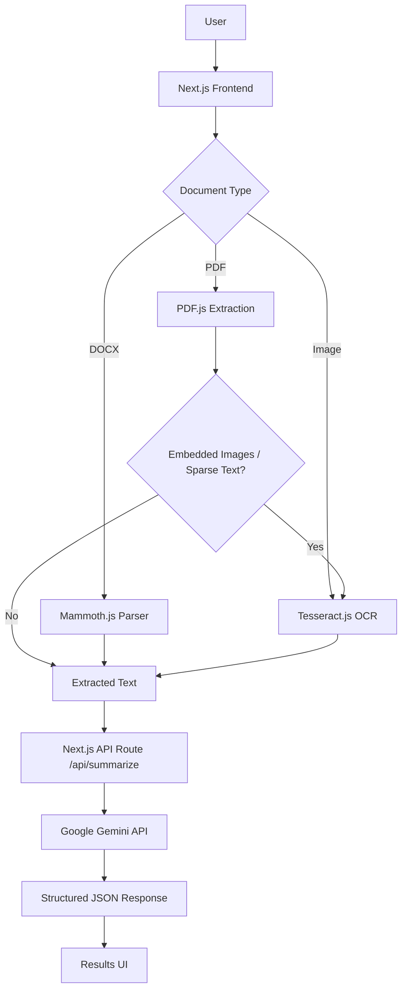

# Document Summary Assistant

> AI-powered document analysis and summarization for PDF, DOCX, and image files.

### Live Demo
**[[https://unthinkable-proj-sahil-23-bce-5114.vercel.app/](https://unthinkable-proj-sahil-23-bce-5114.vercel.app/)](https://unthinkable-proj-sahil-23-bce-5114.vercel.app/)**

---

## 1. Project Overview
The Document Summary Assistant is a lightweight web application that allows users to upload documents and instantly receive intelligent summaries, key points, topics, and actionable suggestions. It supports multiple file formats including PDF, DOCX, PNG, and JPG/JPEG. The application processes files client-side to minimize network payload, utilizing a robust extraction pipeline before generating structured insights via the Google Gemini API.

## 2. Problem Statement
Modern documents often contain large amounts of information scattered across standard text, scanned pages, tables, and images. Manually reviewing and extracting this data is time-consuming. This project solves this by providing a unified document-processing pipeline that extracts raw text, conditionally applies OCR for image-based content, and relies on a Large Language Model (LLM) to generate structured, easily consumable insights.

## 3. Key Features
- **Multi-format Document Upload**: Natively handles PDF, DOCX, PNG, and JPG/JPEG.
- **Drag & Drop**: Seamless upload support via drag-and-drop or standard file picker.
- **PDF Text Extraction**: Extracts native, selectable text from PDF documents.
- **Intelligent OCR**: Applies optical character recognition (OCR) to images, scanned PDF pages, and embedded PDF images.
- **DOCX Processing**: Parses Microsoft Word documents, preserving paragraphs, headings, and tables.
- **AI Summarization**: Integrates with the Google Gemini API for deep contextual understanding.
- **Configurable Summary Length**: Users can toggle between short, medium, or long summary outputs.
- **Key Points & Topics**: Automatically identifies primary topics and extracts the most vital information.
- **Improvement Suggestions**: Provides document-level feedback and suggestions where applicable.
- **Rich Processing States**: Real-time UI feedback mapping the extraction, OCR, and AI generation phases.
- **Error Handling**: Gracefully handles invalid formats, overly large files, extraction failures, and API constraints.
- **Responsive UI**: Fully responsive interface built with Tailwind CSS.
FINAL REPOSITORY AUDIT AND CLEANUP
The technical assessment has the following submission requirements:
Project Structure
Submit only the basic application with all required assignment/project code files.
Do NOT include:
node_modules/
.env
.env.local
.env.* containing secrets
.next/
dist/
out/
build artifacts
.vscode/
.idea/
temporary/editor-specific files
OS-specific files such as .DS_Store
logs
caches
temporary files
The GitHub repository must contain only the files necessary to understand, install, run, build, and deploy the application.
1. AUDIT THE ENTIRE REPOSITORY
Before making changes, inspect the complete repository.
Identify:
source files
configuration files
package files
dependencies
build artifacts
generated files
editor files
temporary files
unnecessary assets
Do NOT blindly delete files.
Only remove files that are generated, sensitive, temporary, editor-specific, or unnecessary for the application.
2. CLEAN THE REPOSITORY
The final repository should NOT contain:
node_modules/ .next/ dist/ out/ .env .env.local .env.production .env.development .vscode/ .idea/ .DS_Store *.log coverage/
Also remove any other generated/cache files that are not required for the project.
3. UPDATE .gitignore
Make sure .gitignore properly excludes at minimum:
node_modules/ .next/ out/ dist/ .env .env.local .env.*.local .vscode/ .idea/ .DS_Store *.log coverage/
Do NOT remove useful source files merely because they are uncommon.
4. IMPORTANT — NEVER COMMIT API KEYS
Verify that no actual Gemini API key exists anywhere in the repository.
Search the project for:
GEMINI_API_KEY AIza
The repository may contain:
.env.example
with:
GEMINI_API_KEY=
but it must NOT contain the actual key.
Do NOT put the real key in:
README
source code
configuration files
screenshots
comments
example files
5. DEPENDENCY AUDIT
This is especially important.
The assessment explicitly says:
No extra modules or package files should be added.
Therefore, inspect:
package.json package-lock.json
and audit EVERY dependency.
For each package ask:
Is this actually required by the implemented application?
Remove unnecessary packages.
Do NOT install libraries simply because they are convenient if the same functionality can reasonably be implemented using:
native browser APIs
existing Next.js functionality
existing React functionality
already-installed dependencies
6. KEEP DEPENDENCIES MINIMAL
The final project should only contain dependencies genuinely required for the implemented features.
For example, dependencies may include packages required for:
Next.js
React
PDF extraction
OCR
DOCX extraction
Gemini API
UI components actually used
validation actually used
But do NOT add unnecessary:
UI libraries
animation libraries
state-management libraries
utility libraries
backend frameworks
database clients
authentication libraries
analytics libraries
testing frameworks that are not actually used
duplicate PDF/OCR libraries
duplicate validation libraries
Do NOT add a package merely to solve a trivial problem that can be handled with native TypeScript/JavaScript.
7. DO NOT BREAK THE APPLICATION
When removing dependencies:
Search the entire codebase for imports.
Confirm the package is genuinely unused.
Remove unused imports.
Run the application.
Run lint.
Run the production build.
Do NOT remove a package if it is required indirectly by the current implementation.
8. PACKAGE FILES
The repository should retain only the package-management files required by the chosen package manager.
For npm, this normally means:
package.json package-lock.json
Do NOT create additional package files such as:
yarn.lock pnpm-lock.yaml bun.lockb
unless the project is actually using that package manager.
Use one package manager consistently.
9. CHECK FOR UNUSED CODE
Also audit the source code for:
unused components
abandoned experimental files
duplicate utilities
old API routes
unused hooks
unused CSS
old test/demo pages
mock data
placeholder components
commented-out implementations
temporary debugging code
Remove unnecessary dead code where it is safe to do so.
Do NOT remove useful documentation or architecture files.
10. CHECK PUBLIC ASSETS
Inspect public/.
Remove:
unused images
temporary screenshots
generated assets
placeholder files
unused icons
Keep only assets actually used by the application.
11. README MUST REMAIN
Keep:
README.md
The README should accurately document:
project overview
live demo
features
architecture
tech stack
setup
environment variables
Vercel deployment
limitations
project structure
The live demo must remain at the top:
[https://unthinkable-proj-sahil-23-bce-5114-document-summary-5z7x1ybrr.vercel.app/](https://unthinkable-proj-sahil-23-bce-5114-document-summary-5z7x1ybrr.vercel.app/)
12. KEEP .env.example
If required, keep:
.env.example
containing only:
GEMINI_API_KEY=
This is documentation/configuration guidance and does NOT contain a secret.
13. VERIFY THE FINAL PROJECT
After cleanup, run:
npm install npm run lint npm run build
Fix any problems caused by the cleanup.
Then verify the application still supports:
PDF upload
PDF native text extraction
PDF image/scanned OCR
DOCX upload
DOCX text extraction
image upload
image OCR
Short summary
Medium summary
Long summary
key points
important topics
improvement suggestions
loading states
error handling
responsive UI
Gemini API integration
Do NOT remove functionality just to reduce dependency count.
14. FINAL GIT STATUS
Run:
git status
and inspect the result.
The repository should NOT contain:
node_modules .next .env .env.local dist out .vscode .idea .DS_Store
or other generated/temporary files.
15. FINAL FILE STRUCTURE
The final repository should look approximately like:
document-summary-assistant/ │ ├── app/ ├── components/ ├── lib/ ├── types/ ├── public/ │ ├── .gitignore ├── .env.example ├── README.md ├── APPROACH.md ├── package.json ├── package-lock.json ├── next.config.* ├── tsconfig.json ├── postcss.config.* ├── eslint.config.* └── other required configuration files
The exact structure should reflect the actual project.
Do NOT create unnecessary files simply to match this example.
16. IMPORTANT — DO NOT PUSH YET
Do NOT push changes to GitHub automatically unless explicitly instructed.
First finish the cleanup and report:
Dependency audit
List:
Removed: - package X — reason - package Y — reason Kept: - package A — reason - package B — reason
Removed files
List the generated/unnecessary files removed.
Final validation
Report:
npm run lint → PASS/FAIL npm run build → PASS/FAIL
Security check
Confirm:
API key found in repository → YES/NO .env.local tracked → YES/NO node_modules tracked → YES/NO .next tracked → YES/NO
Final repository status
Confirm that the repository is clean and suitable for submission.
Do not make unnecessary architectural changes.
The goal is a minimal, clean, production-ready assessment repository containing only the code and configuration required to run and deploy the application.FINAL REPOSITORY AUDIT AND CLEANUP
The technical assessment has the following submission requirements:
Project Structure
Submit only the basic application with all required assignment/project code files.
Do NOT include:
node_modules/
.env
.env.local
.env.* containing secrets
.next/
dist/
out/
build artifacts
.vscode/
.idea/
temporary/editor-specific files
OS-specific files such as .DS_Store
logs
caches
temporary files
The GitHub repository must contain only the files necessary to understand, install, run, build, and deploy the application.
1. AUDIT THE ENTIRE REPOSITORY
Before making changes, inspect the complete repository.
Identify:
source files
configuration files
package files
dependencies
build artifacts
generated files
editor files
temporary files
unnecessary assets
Do NOT blindly delete files.
Only remove files that are generated, sensitive, temporary, editor-specific, or unnecessary for the application.
2. CLEAN THE REPOSITORY
The final repository should NOT contain:
node_modules/ .next/ dist/ out/ .env .env.local .env.production .env.development .vscode/ .idea/ .DS_Store *.log coverage/
Also remove any other generated/cache files that are not required for the project.
3. UPDATE .gitignore
Make sure .gitignore properly excludes at minimum:
node_modules/ .next/ out/ dist/ .env .env.local .env.*.local .vscode/ .idea/ .DS_Store *.log coverage/
Do NOT remove useful source files merely because they are uncommon.
4. IMPORTANT — NEVER COMMIT API KEYS
Verify that no actual Gemini API key exists anywhere in the repository.
Search the project for:
GEMINI_API_KEY AIza
The repository may contain:
.env.example
with:
GEMINI_API_KEY=
but it must NOT contain the actual key.
Do NOT put the real key in:
README
source code
configuration files
screenshots
comments
example files
5. DEPENDENCY AUDIT
This is especially important.
The assessment explicitly says:
No extra modules or package files should be added.
Therefore, inspect:
package.json package-lock.json
and audit EVERY dependency.
For each package ask:
Is this actually required by the implemented application?
Remove unnecessary packages.
Do NOT install libraries simply because they are convenient if the same functionality can reasonably be implemented using:
native browser APIs
existing Next.js functionality
existing React functionality
already-installed dependencies
6. KEEP DEPENDENCIES MINIMAL
The final project should only contain dependencies genuinely required for the implemented features.
For example, dependencies may include packages required for:
Next.js
React
PDF extraction
OCR
DOCX extraction
Gemini API
UI components actually used
validation actually used
But do NOT add unnecessary:
UI libraries
animation libraries
state-management libraries
utility libraries
backend frameworks
database clients
authentication libraries
analytics libraries
testing frameworks that are not actually used
duplicate PDF/OCR libraries
duplicate validation libraries
Do NOT add a package merely to solve a trivial problem that can be handled with native TypeScript/JavaScript.
7. DO NOT BREAK THE APPLICATION
When removing dependencies:
Search the entire codebase for imports.
Confirm the package is genuinely unused.
Remove unused imports.
Run the application.
Run lint.
Run the production build.
Do NOT remove a package if it is required indirectly by the current implementation.
8. PACKAGE FILES
The repository should retain only the package-management files required by the chosen package manager.
For npm, this normally means:
package.json package-lock.json
Do NOT create additional package files such as:
yarn.lock pnpm-lock.yaml bun.lockb
unless the project is actually using that package manager.
Use one package manager consistently.
9. CHECK FOR UNUSED CODE
Also audit the source code for:
unused components
abandoned experimental files
duplicate utilities
old API routes
unused hooks
unused CSS
old test/demo pages
mock data
placeholder components
commented-out implementations
temporary debugging code
Remove unnecessary dead code where it is safe to do so.
Do NOT remove useful documentation or architecture files.
10. CHECK PUBLIC ASSETS
Inspect public/.
Remove:
unused images
temporary screenshots
generated assets
placeholder files
unused icons
Keep only assets actually used by the application.
11. README MUST REMAIN
Keep:
README.md
The README should accurately document:
project overview
live demo
features
architecture
tech stack
setup
environment variables
Vercel deployment
limitations
project structure
The live demo must remain at the top:
[https://unthinkable-proj-sahil-23-bce-5114-document-summary-5z7x1ybrr.vercel.app/](https://unthinkable-proj-sahil-23-bce-5114-document-summary-5z7x1ybrr.vercel.app/)
12. KEEP .env.example
If required, keep:
.env.example
containing only:
GEMINI_API_KEY=
This is documentation/configuration guidance and does NOT contain a secret.
13. VERIFY THE FINAL PROJECT
After cleanup, run:
npm install npm run lint npm run build
Fix any problems caused by the cleanup.
Then verify the application still supports:
PDF upload
PDF native text extraction
PDF image/scanned OCR
DOCX upload
DOCX text extraction
image upload
image OCR
Short summary
Medium summary
Long summary
key points
important topics
improvement suggestions
loading states
error handling
responsive UI
Gemini API integration
Do NOT remove functionality just to reduce dependency count.
14. FINAL GIT STATUS
Run:
git status
and inspect the result.
The repository should NOT contain:
node_modules .next .env .env.local dist out .vscode .idea .DS_Store
or other generated/temporary files.
15. FINAL FILE STRUCTURE
The final repository should look approximately like:
document-summary-assistant/ │ ├── app/ ├── components/ ├── lib/ ├── types/ ├── public/ │ ├── .gitignore ├── .env.example ├── README.md ├── APPROACH.md ├── package.json ├── package-lock.json ├── next.config.* ├── tsconfig.json ├── postcss.config.* ├── eslint.config.* └── other required configuration files
The exact structure should reflect the actual project.
Do NOT create unnecessary files simply to match this example.
16. IMPORTANT — DO NOT PUSH YET
Do NOT push changes to GitHub automatically unless explicitly instructed.
First finish the cleanup and report:
Dependency audit
List:
Removed: - package X — reason - package Y — reason Kept: - package A — reason - package B — reason
Removed files
List the generated/unnecessary files removed.
Final validation
Report:
npm run lint → PASS/FAIL npm run build → PASS/FAIL
Security check
Confirm:
API key found in repository → YES/NO .env.local tracked → YES/NO node_modules tracked → YES/NO .next tracked → YES/NO
Final repository status
Confirm that the repository is clean and suitable for submission.
Do not make unnecessary architectural changes.
The goal is a minimal, clean, production-ready assessment repository containing only the code and configuration required to run and deploy the application.
## 4. Architecture



The project is built as a single, full-stack Next.js application. The frontend orchestrates file processing and text extraction directly in the browser. The extracted text is then passed to a secure server-side API route which communicates with the Gemini API to retrieve structured AI output.

## 5. Engineering Decisions

- **Client-Side Document Processing**: Document parsing (PDF.js, Mammoth.js, Tesseract.js) executes in the browser. This drastically reduces the data sent over the network, removes the need for temporary cloud storage, and keeps the serverless backend lightweight.
- **Server-Side Gemini Integration**: The frontend never communicates directly with Google's API. The Gemini API key remains securely enclosed within a Next.js server-side endpoint, protected from client exposure.
- **Stateless Architecture**: The application is entirely stateless. No database is required because the assessment strictly focuses on the immediate pipeline of document processing and summarization.
- **Vercel Deployment**: By utilizing Next.js API routes, the frontend and backend functionality are seamlessly packaged and deployed as a single Vercel application without needing a separate backend server.

## 6. Tech Stack

| Layer | Technology |
|---|---|
| **Frontend Framework** | Next.js, React, TypeScript |
| **Styling** | Tailwind CSS |
| **PDF Processing** | PDF.js (`pdfjs-dist`) |
| **DOCX Processing** | Mammoth.js |
| **OCR Engine** | Tesseract.js |
| **AI Integration** | Google Gemini API (`@google/genai`) |
| **Backend** | Next.js API Routes |
| **Validation** | Zod |
| **Hosting** | Vercel |

## 7. Core Processing Pipeline

1. **Upload**: User provides a file via the UI.
2. **Validate**: Client validates MIME type and file size.
3. **Extract**: Unified pipeline routes the file to the correct parser.
4. **Conditional OCR**: If a PDF contains embedded images or sparse text, it is rendered to an off-screen canvas and passed through Tesseract OCR. OCR output is deduplicated against native text.
5. **Clean**: Text is normalized and prepped for the LLM.
6. **API Request**: Extracted text is sent to the local Next.js `/api/summarize` endpoint.
7. **Gemini Analysis**: Server instructs Gemini to return a structured JSON response.
8. **Render**: Frontend receives the JSON and dynamically maps the insights to the UI.

## 8. AI Output

The Gemini system prompt strictly defines a structured JSON schema, ensuring consistent rendering. The application currently utilizes the following fields:
- **`summary`**: A concise overview of the document based on the requested length.
- **`keyPoints`**: An array of the most critical data points.
- **`importantTopics`**: The major themes or subjects discussed.
- **`improvementSuggestions`**: Actionable feedback based on the content (where applicable).

## 9. Security
- The Gemini API key is securely stored as a server environment variable.
- `.env.local` is explicitly excluded from version control via `.gitignore`.
- Uploaded files are processed strictly in-memory and are never persisted to disk or external databases.
- Strict input validation prevents oversized files or unsupported MIME types from executing.

## 10. Local Development

Clone the repository and install dependencies:
```bash
git clone <repository-url>
cd Unthinkable-proj
npm install
```

Create a local environment file:
```bash
touch .env.local
```

Inside `.env.local`, provide your API key:
```env
GEMINI_API_KEY=your_actual_api_key_here
```

Start the development server:
```bash
npm run dev
```
The application will be accessible at `http://localhost:3000`.

## 11. Production Build

To verify that the application compiles correctly without type errors:
```bash
npm run lint
npm run build
```

## 12. Vercel Deployment

This project requires zero infrastructure setup outside of Vercel. 
1. Push the repository to GitHub.
2. Import the repository as a new project in your Vercel dashboard.
3. In the Vercel project settings, configure the environment variable:
   - Name: `GEMINI_API_KEY`
   - Value: `<your-google-gemini-api-key>`
4. Click Deploy.

The Next.js API routes are automatically converted into serverless functions by Vercel, meaning **no separately hosted backend is required**.

## 13. Environment Variables
```env
GEMINI_API_KEY=your_gemini_api_key
```
> **Warning**: Never commit your `.env.local` file to Git, and never prefix the Gemini API key with `NEXT_PUBLIC_`, as this would expose it to the browser.

## 14. Limitations
- **Browser OCR Performance**: Executing Tesseract.js in the browser is computationally expensive. Very large or highly complex scanned documents may require significant processing time.
- **OCR Accuracy**: OCR accuracy is inherently tied to the quality, contrast, and resolution of the source image or scanned PDF.
- **Word Document Images**: To maintain client-side stability, images embedded within `.docx` files are intentionally bypassed. Mammoth.js accurately extracts paragraphs, tables, and lists, but complex image-heavy Word docs are better suited for the PDF pipeline.
- **Visual Formatting**: Complex multi-column layouts or highly styled PDFs may not retain their exact reading order when translated to raw text.

## 15. Future Improvements
- Persistent document history and user authentication.
- Background task queues (e.g., Redis/Celery) for processing excessively large documents outside the browser.
- Web Worker parallelization for faster multi-page OCR.
- Multi-language OCR support.
- Exporting generated summaries to PDF or DOCX.

## 16. Project Structure
```text
/
├── app/
│   ├── api/
│   │   └── summarize/
│   │       └── route.ts     # Server-side Gemini API integration
│   ├── globals.css          # Tailwind and global styles
│   ├── layout.tsx
│   └── page.tsx             # Main frontend application
├── components/
│   ├── summary/             # Results rendering, processing states, length controls
│   └── upload/              # File dropzone and previews
├── lib/
│   ├── config.ts            # Application constraints and MIME types
│   ├── document.ts          # Unified document extraction pipeline
│   ├── docx.ts              # Mammoth.js parsing
│   ├── gemini.ts            # Gemini API client setup
│   ├── ocr.ts               # Tesseract.js worker management
│   └── pdf.ts               # PDF.js hybrid text/canvas extraction
├── types/                   # TypeScript interfaces and declarations
├── .env.example
├── .gitignore
├── package.json
└── README.md
```

---
### Technical Assessment Context
This project was developed as a Software Engineering technical assessment focused on document processing, client-side OCR architectures, AI-assisted summarization, API integration, React/Next.js frontend engineering, and serverless cloud deployment.
